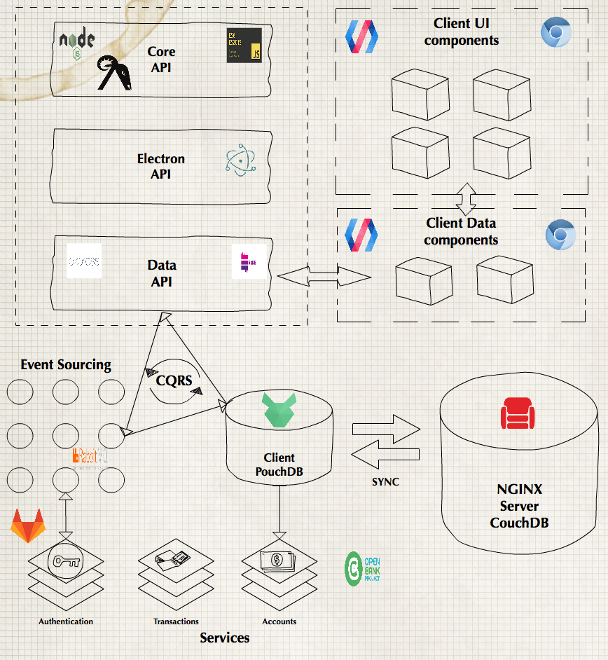
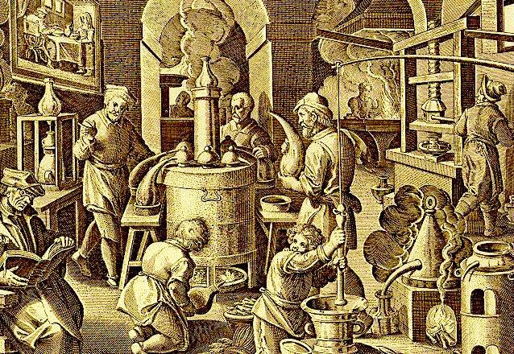

```
         ooooo ooooo      ooo                      .oooooo.
         `888' `888b.     `8'                     d8P'  `Y8b
 .oooo.o  888   8 `88b.    8   .ooooo.  oooo d8b 888           oooo    ooo
d88(  "8  888   8   `88b.  8  d88' `88b `888""8P 888            `88.  .8'
`"Y88b.   888   8     `88b.8  888ooo888  888     888     ooooo   `88..8'
o.  )88b  888   8       `888  888    .o  888     `88.    .88'     `888'
8""888P' o888o o8o        `8  `Y8bod8P' d888b     `Y8bood8P'       .8'
                                                               .o..P'
                                                               `Y8P'
```


# ☢️ WORK IN PROGRESS


# sINerGy

A pluggable banking desktop application based on the [Open Bank Project][1] using [Electron][2] and [Polymer][3].

## Find out more about:

- [Technology stack](./docs/technology-stack)
- [Project board & the teams](https://trello.com/b/N68z43ZK/sinergy)

## Macro architecture



# Development

### Get started
Download Docker app
<https://docs.docker.com/engine/installation/>

```sh
make
```
> It might take a while first time to pull all the images

### Containers info

```sh
make info
```

### Build

```sh
make build <service>
```


## Desktop

TBA

## CLI

TBA

## MicroServices

### WEB - Default
- https://web.sinergy.localhost -> http://localhost:8081

### API
- https://api.sinergy.localhost -> http://localhost:4000

### DB
- https://db.sinergy.localhost/_utils/fauxton/

### RabitMQ
- http://bus.sinergy.localhost/


### QA
TBA

### Monitoring & Logging

> For more see Makefile for more info until `make help` is complete

### &copy; an AppChemistry project.




[1]:https://www.openbankproject.com/
[2]:https://electron.atom.io/
[3]:https://www.polymer-project.org/
